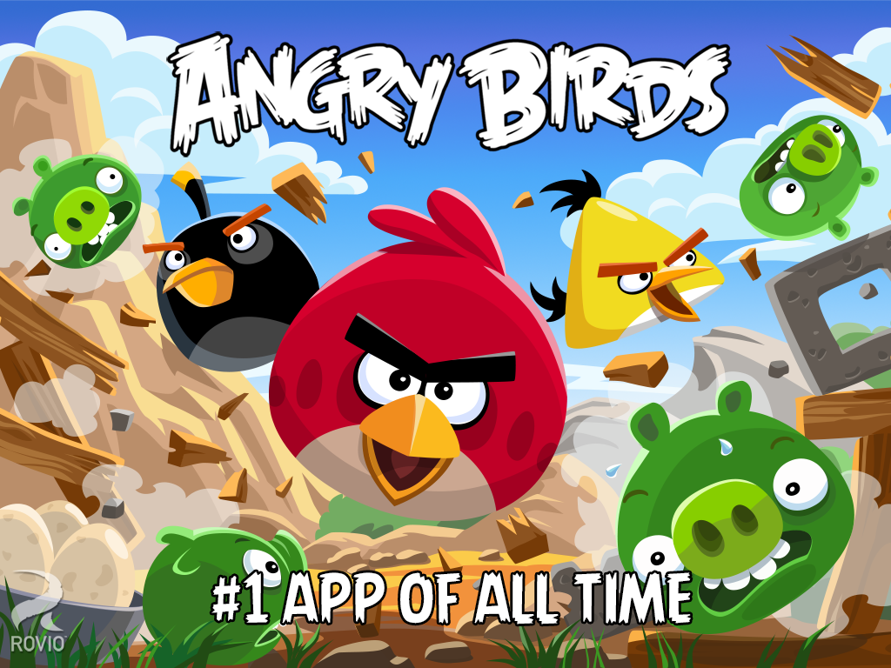

# [fit] Freemium
# [fit] for the Rest of Us

### Patrick Rauland - @BFTrick

^ I'm going to talk about a success story. A story where there is an unknown company that releases a new product in an industry with 200,000 other products.

^ After 5 years the company is worth 1 billion dollars

---

# [fit] Selling Something is
# [fit] *Hard*

^ Madmen - you just need an advertising budget and you can sell anything.

^ Who here saw the latest X-men movie where they go back to the past? There's this great line where they say, "I wrote a program that records *all 3* networks and PBS."

^ It didn't matter what you sold; as long as you had a good marketing team you could sell anything. There was no Internet where you can look at the reviews. There was no YouTube where you can see how easy it is to setup.

---

# [fit] We're Drowning in
# [fit] *Information*

^ The average person is served over 1,700 banner ads per month. Do you remember any?

^ Do you know what a good conversion rate is for a banner ad on a website? .1%. That's dismal.

---

# [fit] *7 Million*
# [fit] Results for "WordPress E-Commerce Plugin"

^ If you want to find out the best e-commerce plugin for WordPress.

---

# [fit] How do *you*
# [fit] Stand out
# [fit] *Against Millions*?

---

# [fit] Give Something Away
# [fit] *For Free*

^ and when I say free I mean free free. No 30 day trials, no usage limits, give something people can use.

^ with any electronic good it's incredibly easy to give stuff away for free at no cost to yourself

---

> Build a better mousetrap, and the world will beat a path to your door

-- Ralph Waldo Emerson

^ Does anyone here know this quote?

^ Isn't this the quintessential american dream?

---

# [fit] It's *wrong*

---

# [fit] Qwerty & Dvorak

^ Who here knows what Dvorak is? How about Qwerty?

---

# Qwerty

^ Qwerty was designed to prevent jams by placing common keys away from each other like "th" or "st".

---

# Dvorak

^ Every word in the English language has a vowel and only the "A" key is on the home row. The rest of them are spread out so you have to move your fingers.

---

# [fit] Free Products do
# [fit] *Two*
# [fit] Amazing Things

^ and I'm going to tell you the first one right now

---

# [fit] #1 Free Products Lower the
# [fit] *Switching Costs*

^ So while I still would have to learn Dvorak I wouldn't have to buy a new keyboard.

---

# [fit] Human Beings
# [fit] *Love* Information

---

# [fit] We're *Drowning*
# [fit] in Information
# [fit] Because We *Crave* It

^ There's a reason there's 7 million results for e-commerce solutions

^ There's a reason that there's youtube tutorials for everything under the sky

^ We research everything. We look up menus before we go to restaurants, we ask our friends for advice for just about anything, we use our GPS systems to go three blocks, and when we don't have any of those we look up our horoscopes.

^ We love knowing what other people are doing and what we should be doing

---

# [fit] We Care
# [fit] About The *How*
# [fit] of Things Work

^ Back in the Madmen days you could say "it's so easy", "it's so fast", "it does everything you need". But we've grown up since then.

---

# [fit] We're More
# [fit] *Skeptical*

^ Back in the Madmen days you could say "it's so easy", "it's so fast", "it does everything you need". But we've grown up since then.

^ Easy & Fast Couldn't Mean Less now. They're the two words that infomercials rely on.

^ Honestly easy and fast are throw away words. Are there any products that aren't fast or aren't easy?

^ We don't trust marketers anymore. There's a reason by Seth Godin named his book All Marketers are Liars.

---

# [fit] Let Your Product
# [fit] Be Your Marketing Team

^ I think the marketing department is outdated. There shouldn't be a marketing department that's all talk and no show.

^ We don't have to read through documentation. We use friends, we use reviews, and we use demos to do research for us.

^ If you're selling a CD I want to know your sound. If you're a writer I want to know your style. If you're a film maker I want to know your cinematography. If you're a game developer I want to know how you challenge the user. If you have the best plugin I want to know how you update it.

---

# [fit] #2 Free Products
# [fit] *Inform* Your Users

---

# [fit] Nothing is better
# [fit] selling your product
# [fit] than the product itself

^ If you use WooCommerce and love everything about it except you want to use Stripe instead of PayPal you know that everything else is going to work exactly the same except the payment at the end. The products will be layed out the same. They'll be input the same. They taxes are calculated the same, so is the shipping.

---

# [fit] Back to the story

^ Do you remember the story I started with. The business that competed with 200,000 competitors and is now valued more than 1 billion dollars?

---

---

# [fit] Examples

---

# Leo Babauta From ZenHabits.net

---

---

---

---

---

---

---

---

---

# [fit] Freemium sells your
# [fit] product for you
# [fit] You just have to
# [fit] let go of a tiny piece

---

# [fit] Patrick Rauland - @BFTrick

